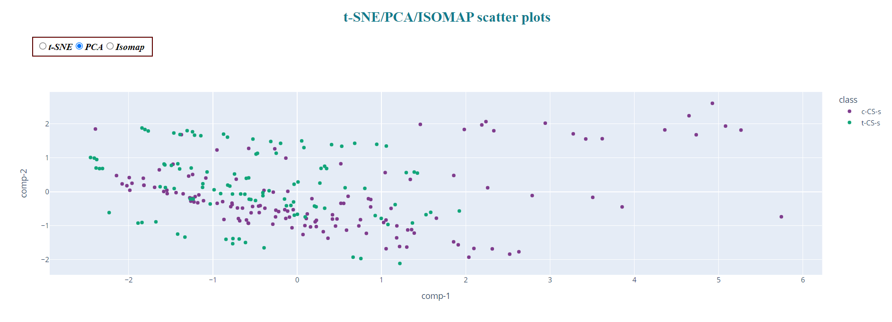

# Dash_Data-Visualization-Apps

With Dash, a productive Python framework for building web applications, we can create data visualization apps with custom user interfaces in Python. In this project, I explored Dash and try to add some user interfaces to plots created by Ploty. For creating the web interfaces, you need to be familiar with HTML and CSS. Also, you can use the Dash documentation for help. 

The documentation of Dash: https://dash.plotly.com/

For this project, the dataset I am going to use is Data_Cortex_Nuclear.xls with a dimensionality of more than 2. At first, I reduced the dimensionality of this dataset to two by using 3 dimensionality reduction techniques PCA, ISOMAP, and t-SNE. Then, I plotted a scatter plot for each technique. You can choose which plot to show using radio buttons. 

You can also choose 2 features from the main dataset and only have a scatter plot for these two features as axes. Then, you can add(delete) a scatter plot with the same features you chose under the mentioned plot.

